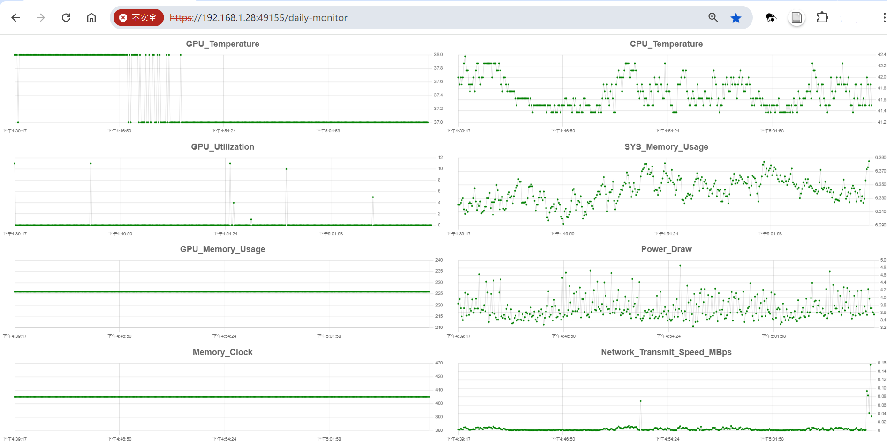

# **System Monitor**
This project is a system monitoring tool that allows you to collect, display, and analyze system metrics in real-time and over time. It consists of three main components:

1. **Backend API Server**: A Node.js server connected to MongoDB for storing and providing data via RESTful API.
2. **Frontend Web Application**: A Next.js React application that displays real-time and historical system metrics, rendering graphs using libraries like Chart.js or D3.js.
3. **Python Upload Script**: A script that collects system statistics (e.g., CPU usage, memory usage, GPU stats via `nvidia-smi`) and uploads them to the backend server at regular intervals.


---
## Features

- **Real-time Monitoring**: View live system metrics such as CPU usage, memory consumption, disk I/O, and GPU statistics.
- **Historical Data**: Analyze system performance over time with aggregated data and interactive visualizations.
- **Customizable Metrics**: Configure which metrics to collect and display using RESTful APIs, allowing flexibility based on user needs.
- **User Authentication**: Secure access to the application with admin and user roles.
- **Responsive Design**: Accessible on various devices, including desktops, tablets, and smartphones.


---

## Prerequisites

Before you begin, ensure you have the following installed on your system:

- **Operating System**: Linux (tested on Ubuntu, but should work on other distributions)
- **Node.js**: backend and frontend
- **npm**: package manager
- **Python**: Version 3.x
- **MongoDB**: A running MongoDB instance for data storage
- **Git**: For cloning the repository
---

## Installation

### 1. Clone and install the Repository

Open a terminal and clone the repository to your local machine:

```bash
# Clone the repository
git clone https://github.com/yourusername/system-monitor.git
cd system-monitor

# Install backend dependencies
cd backend
npm install

# Install frontend dependencies
cd ../system-monitor-frontend
npm install
```

### 2. Configure the Application

Several configuration files contain placeholders marked with "TODO" that need to be updated with your specific settings. Locate and replace these placeholders to ensure the application runs correctly.

###### backed end api endpoint and user 

``` 
./upload_log.sh:4:BASE_URL='https://localhost:"TODO"/api'
./upload_log.sh:7:USERNAME='"TODO"'
./upload_log.sh:8:PASSWORD='"TODO"'


./system-monitor-backend.service:7:User="TODO"
./system-monitor-backend.service:8:WorkingDirectory="TODO"
./system-monitor-backend.service:12:Environment=PORT="TODO"

./upload_stat_loop.py:31:BASE_URL = 'https://localhost:"TODO"/api'
./upload_stat_loop.py:34:USERNAME = '"TODO"'
./upload_stat_loop.py:35:PASSWORD = '"TODO"'

./backend/config/config.yaml:2:  port: "TODO"
./backend/config/config.yaml:22:    - "TODO"
./backend/scripts/setupAdmin.js:27:  const username = '"TODO"';
./backend/scripts/setupAdmin.js:28:  const password = '"TODO"'; // Replace with a strong password
./system-monitor-upload.service:9:User="TODO"
./system-monitor-upload.service:10:WorkingDirectory="TODO"

```
##### THe place to cat the cpu teperature  in **./upload_stat_loop.py:67:** 
```
    
with open('"TODO"/temp1_input', 'r') as f:

```
##### Front end config
```
./system-monitor-frontend.service:7:User="TODO"
./system-monitor-frontend.service:8:WorkingDirectory="TODO"
./system-monitor-frontend.service:12:Environment=PORT="TODO"
./system-monitor-frontend/server.js:20:    console.log('> Server listening on https://0.0.0.0:"TODO"');
./system-monitor-frontend/.env.local:1:NEXT_PUBLIC_API_BASE_URL=https://"TODO":"TODO"/api

```


## 5. Set Up System Services 

To run the application components as system services that start on boot, you can set up systemd service files.

Warning: Setting up system services requires administrative privileges and should be done carefully.

## 6 Set upadmin
To set up admin you can change the script of ./backend/scripts/setupAdmin.js to create admin user.
Admin user should not be created from api.

## 7 Server Certificate

Both server run in https and the cert should place in follow
```
./system-monitor-frontend/server.cert
./system-monitor-frontend/server.key
./backend/server.cert
./backend/server.key

```
generate by 
```
openssl x509 -req -days 365 -in server.csr -signkey server.key -out server.crt
```
---
##### DailyMonitor\Screen Shot

